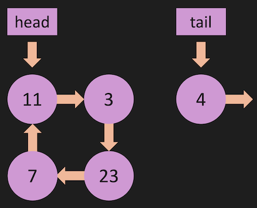
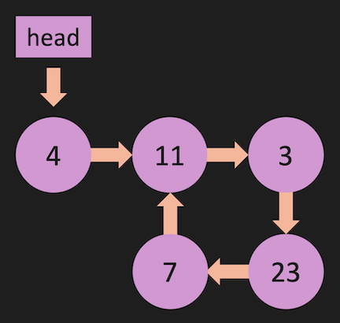

# Has Loop

Implement a function called `hasLoop` to detect if a given singly-linked list contains a loop (a cycle) or not.

The function should return `true` if a loop is detected in the linked list, and `false` otherwise.

<b>Function Signature:</b>

`bool hasLoop();`

You are required to use Floyd's cycle-finding algorithm (also known as the "tortoise and the hare" algorithm) to detect the loop.

This algorithm uses two pointers: a slow pointer and a fast pointer. The slow pointer moves one step at a time, while the fast pointer moves two steps at a time. If there is a loop in the linked list, the two pointers will eventually meet at some point. If there is no loop, the fast pointer will reach the end of the list.

If your Linked List contains a loop, it indicates a flaw in its implementation. This situation can manifest in several ways:

